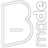

    
#  robots
**Create and simulate ABB, KUKA, UR, Staubli, Franka Emika, Doosan, Fanuc, Igus, and Jaka robot programs in Rhino 8, Grasshopper, and .NET**

**[About](#about) •
[Install](#install) •
[Docs](../../../wiki) •
[Support](#support) •
[Sponsors](#sponsors)**

## About

**Robots** is a plugin for **[Rhino 8](https://www.rhino3d.com/)** and the **Grasshopper** visual programming interface, with a .NET API for use in custom applications and automation. It lets users create, check, simulate, and save manufacturer-specific robot programs.

Supported manufacturers include **ABB**, **KUKA**, **UR**, **Staubli**, **Franka Emika**, **Doosan**, **Fanuc**, **Igus**, and **Jaka**. Robots can load robot systems, tools, frames, and meshes from XML/3DM libraries, use custom post-processors, and generate manufacturer-specific robot code.

## Install

> If upgrading from an old version check [here](../../../wiki/home#Upgrading-from-an-older-version).

### Grasshopper plugin

1. Install in **Rhino 8** for **Windows** or **macOS** using the `_PackageManager` command, search for `Robots`.
1. Restart **Rhino** and open **Grasshopper**. There should be a new tab in **Grasshopper** named `Robots`.
1. Install a robot library by clicking on the `Libraries` button of a `Load robot system` component.
   > The robots from the library should appear in a **value list** connected to a `Load robot system` component.
1. Read the [docs](../../../wiki) for more info.
1. Check the [samples](../samples/).
   > When opening a sample file, a dialog box might pop up with an assembly not found message. You can close this without fixing the path, it will automatically get fixed after the sample file is loaded.

### .NET packages

- [`Robots`](https://www.nuget.org/packages/Robots) is the core .NET 8 package built on `Rhino3dm` for use outside Rhino.
- [`Robots.Rhino`](https://www.nuget.org/packages/Robots.Rhino) provides compile-time references for developing Rhino and Grasshopper plug-ins.

## Support

### 🆓 [Community](https://github.com/visose/Robots/discussions)

Ask any questions in our discussions forum.
### 💼 [Commercial](https://visose.com/robots)

Partner with the creators of Robots to ensure you have the best support for your organization. You can find more information [here](https://visose.com/robots).

## Sponsors

The continued development and maintenance of this project is made possible by our sponsors and commercial partners. Become a sponsor by purchasing [commercial support](https://visose.com/robots), or by donating via [GitHub Sponsors](https://github.com/sponsors/visose) or [PayPal](https://visose.com/paypal).

### Our top sponsors

